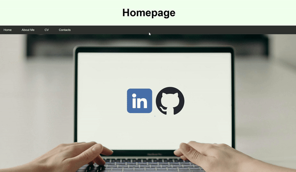

# Meine Persönliche Webseite
23.4 bis 25.6.2024

- Ich wollte eine eigene Webseite erstellen, um einen einfachen Überblick über mich und ein Projekt zu geben. Also ist es eine Erweiterung meine Github. Ausserdem wollte ich es einfach mach, auf mein LinkedIn hinzuweisen.

- Beim Lebenslauf habe es wie auf dem Mockup gemacht. Zuerst habe ich nur ein Bild des CV abgebildet, zum Glück habe ich auf Satckoverflow eine coole Methode gefunden, um ein PDF im Web abzubilden.

- Da ich mich noch nicht mit Backend Development befasst habe. Benutzte ich für die E-Mail formspree.io. Das wurde uns von Herr Colic empfohlen, um unsere E-Mail-Adressen nicht direkt ins Internet zu setzen. Darum habe ich auch so eingebaut. Ich habe den Text in der Box eingefügt da es sonst Leer Aussicht.

## Grob-Planung

1. Mit meinen momentanen Noten bin ich noch nicht zufrieden, auch wenn sie genügend sind.

2. Der Code wurde leserlich und strukturiert gebaut, um für Testfälle anspruchsvollere Anforderungen zu stellen. Mein Ziel ist es, für mein Projekt einen Plan zu erstellen. Um das zu erreichen, erstelle ich eine Datei, um die Prioritäten der Komponenten festzulegen.

3.Ich möchte eine Website für mich mit z.B. Curriculum Vitae bauen oder About me usw.
## 23.4.2024
✍️ Heute war ich voll und ganz in Modul 106 vertieft (Nachweis 2404_DQL_Abfragen_einfach - Nachweis 2400_SQL_Datensicherung). Die Aufgaben forderten mich heraus, SQL-Befehle zu formulieren und neue Funktionen wie GROUP BY und SNAPSHOT zu erkunden. Trotzdem brauchte ich viel Hilfe von Herrn Stäubler, da er das Thema besser versteht als ich.

## 30.4.2024

- [x] Prioritätenliste auf md ode docx erstellen und auf github hochladen
- [x] Visual Studio Code Instaliern und Curriculum Vitae von github auf ein Htpps datei kopieren
- [x] Bild meines gesicht einfügen
- [ ] Scaling mit grösse tab grösse erstellen 

✍️ Heute habe ich zum ersten Mal mit HTML und CSS gearbeitet. Als Erstes habe ich mir VS Code heruntergeladen, zusammen mit der "Live Server" Extension. Als Nächstes habe ich mich auf w3schools.com in HTML eingelesen, um den Anfang zu vereinfachen. Mein größter Erfolg war, dass ich heute eine Verbindung zwischen zwei Webseiten hergestellt habe.

## 23.5.2024
- [x] Bild und CV Anpassen
- [x] Im About me einen Teil für medien
- [x] Ein Ort für Kontakte
- [x] Im About me über die Ims etwas Colles Machen(Fällt mir noch nichts ein) PDF einführen

✍️ Heute habe ich auf meiner Webseite einige bedeutende Verbesserungen vorgenommen. Ich habe zwei Schaltflächen programmiert, die zu meinem GitHub- und LinkedIn-Profil führen, was den Besuchern das Finden meiner beruflichen Profile erleichtert. Zusätzlich habe ich meinen Lebenslauf als PDF-Dokument eingebaut, sodass Interessierte diesen direkt herunterladen können. Das wichtigste Update war die Integration einer Kontaktsektion, die es den Besuchern ermöglicht, mich einfach und unkompliziert über die Webseite zu erreichen.

## 31.5.2024
- [ ] Bild auf der Homepage einfügen und die zwei Buttons an bessere Orte setzen
- [ ] (wenn möglich) Bestätigungs-E-Mail bei Kontaktanfragen einbauen
- [ ] Hover-Effekt bei den Medienbuttons
- [ ] (wenn möglich) Ein paar Beispiele meiner früheren Projekte hinzufügen
      
✍️ Heute habe ich hauptsächlich an Modul 122: Abläufe mit einer Scriptsprache automatisieren gearbeitet, da ich noch nicht so weit bin, wie ich gedacht habe. Bei der Aufgabe LA_122_1709_PunktNotation.docx haben wir mit den Methoden .Replace() und .ToLower() einen String verändert. Danach haben wir Get-Service wuauserv mit .stop() und .status verwendet. Zuletzt haben wir überprüft, wie viel MB im Ordner C:\Windows\Media\ sind. Bei der Aufgabe LLA_122_1710_SortierenProjizierenSelektieren habe ich gelernt, Daten zu sortieren, zu projizieren und zu filtern, indem ich verschiedene Cmdlets für die Untersuchung von Netzwerkadaptern, Diensten und Dateien verwendet habe.
## 07.6.2024

- [x] Bild auf der Homepage einfügen und die zwei Buttons an bessere Orte setzen
- [x] anpassen das es auf ein Handy gut ausseht
- [ ] Hover-Effekt bei den Medienbuttons
- [ ] (wenn möglich) Ein paar Beispiele meiner früheren Projekte hinzufügen

✍️ Heute habe ich lange an der Anpassung für Mobilgeräte gearbeitet. Dabei stieß ich auf ähnliche Probleme wie zuvor mit der Taskleiste und einem Bild. Stack Overflow halfen mir, die Layouts anzupassen, aber es kostete Zeit, alles perfekt für Pc und Mobilgeräte  auszurichten.

- [ ] Hover-Effekt bei den Medienbuttons
- [ ] (wenn möglich) Ein paar Beispiele meiner früheren Projekte hinzufügen
- [ ] Contacts besser aussehen lassen
- [ ] Bestätigung erstellen bei Contacts

✍️ Heute habe ich am Modul 122 gearbeitet und einen PowerShell-Code erstellt, der mir über eine API die Temperatur als Benachrichtigung ausgibt. Leider funktioniert der Trigger nicht, wenn ich mich einlogge, weshalb ich momentan im Projekt nicht weiterkomme.

- [x] Hover-Effekt bei den Medienbuttons
- [x] Contacts besser aussehen lassen
Heute habe ich einen Hover-Effekt zu meinen Medienbuttons hinzugefügt, um mehr Benutzerfeedback zu geben. Zusätzlich habe ich die Kontaktbereiche verbessert, indem ich sie zentriert und informativen Text eingebaut habe. Diese Änderungen machen die Seite optisch ansprechender und erleichtern die Nutzung, was zu einer besseren Benutzererfahrung beiträgt und die Interaktivität erhöht.
